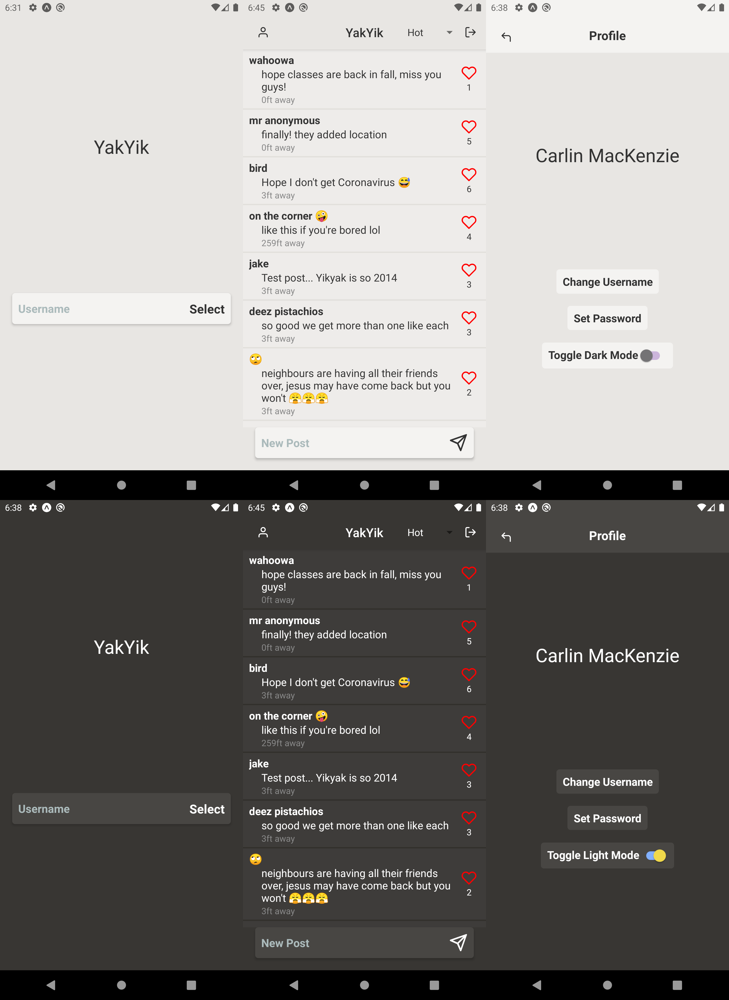

# YakYik

A Yikyak clone in React with Redux for [Mobile App Development](https://danielggraham.com/mobile-development-in-react/) at the University of Virginia. I chose to make this as I think anonymity is a fun aspect of online communication that is being lost.

This app allows you to choose any username and password protect it if you want. There is no limit to the number of usernames a user can use. The users location is used to show how far away other users are. The feed can be sorted by new, hot and nearby.

[▶ Video](https://youtu.be/hz4Sz113V8U)

[Expo](https://expo.io/@ckm8gz/yakyik)
